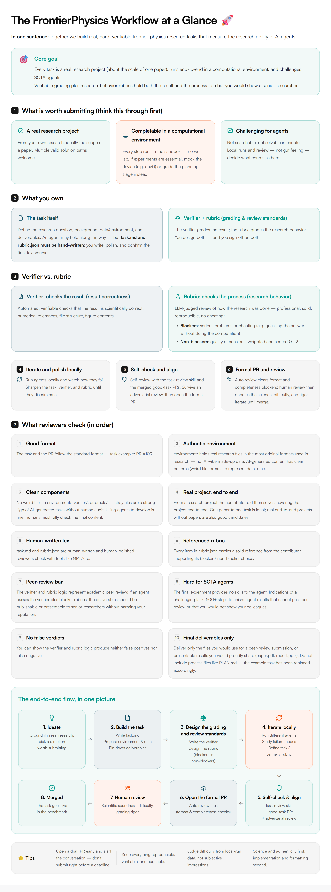

# FrontierPhysics

[](https://discord.gg/G9dg3EfSva)
[](https://github.com/benchflow-ai/FrontierPhysics)
[](docs/wechat-qr.jpg)

Are AI agents good physicists?

**FrontierPhysics**: Evaluate agents for end-to-end frontier physics research.

**[Contributing](CONTRIBUTING.md)** · **[BenchFlow SDK](https://github.com/benchflow-ai/benchflow)** · **[Discord](https://discord.gg/G9dg3EfSva)**

## What is FrontierPhysics?

FrontierPhysics is a benchmark evaluating how AI agents do **frontier physics research** end-to-end — realistic challenges drawn from real research problems that take a physics PhD **weeks of effort** and that SOTA agents **struggle** with, graded by verifiable checkers plus per-task rubric-based reviewer agents. How tasks are built, graded, and reviewed is all in the picture below.

[](https://www.benchflow.ai/frontierphysics/workflow.html)

> 🖱 The picture is a static render, so links inside it are not clickable. Click the image for the [interactive version](https://www.benchflow.ai/frontierphysics/workflow.html) (English / 中文), or jump straight to: [join form](https://forms.gle/eZk26ffY6tfECeCk9) · [example task PR #109](https://github.com/benchflow-ai/FrontierPhysics/pull/109) · [PR template](.github/PULL_REQUEST_TEMPLATE.md) · [task-review skill](.agents/skills/task-review) · [Discord](https://discord.gg/G9dg3EfSva)

## Quick Start

```bash
git clone https://github.com/benchflow-ai/FrontierPhysics.git
cd FrontierPhysics

# Install or upgrade to the latest stable BenchFlow CLI.
uv tool install --upgrade benchflow

# Install repository tooling from the committed lockfile.
uv sync --locked

# Validate a native task.md package.
bench tasks check tasks/multiplexing-ion-chain-qnet

# Oracle must pass before agent runs.
bench eval run \
  --tasks-dir tasks/multiplexing-ion-chain-qnet \
  --agent oracle \
  --sandbox docker
```

Runnable benchmark tasks live under `tasks/`. FrontierPhysics uses `uv.lock` for reproducible repository tooling while the `bench` CLI runs task validation and evaluations.

### API Keys

Running hosted agents may require provider credentials or an authenticated local agent session. Export only the credentials required by the selected agent. Keep secrets in an ignored `.env` or `.envrc`; never commit them.

### Creating Tasks

Not sure what to propose? See the [task ideation guide](docs/task-ideation.md) for
the kinds of research subproblems that make good tasks, with idea-level examples
across experimental and theoretical domains.

FrontierPhysics tasks are native BenchFlow `task.md` packages:

```text
tasks/<task-id>/
  task.md
  environment/
    Dockerfile
    skills/   # If need any
  oracle/
    solve.sh
  verifier/
    rubric.json   # For LLM as judge
    test.sh
    test_outputs.py
```

See [CONTRIBUTING.md](CONTRIBUTING.md) for scientific-quality requirements, metadata, validation, and review evidence.

Read [goodtask-frontierphysics.md](.agents/skills/task-review/goodtask-frontierphysics.md) to have a better understanding about what is the definition of a "good-task".

## Get Involved

- **Discord**: [Join our server](https://discord.gg/G9dg3EfSva)
- **WeChat**: [Scan QR code](docs/wechat-qr.jpg)
- **Weekly sync**: Thursday 7PM PT / 10PM ET

### Authorship policy

A merged task earns **6 points**, a referral **2 points** (once the referred contributor merged at least 1 task), a task review **2 points** (once the task has been merged). At **12 points** you are a co-author on the FrontierPhysics paper and dataset. To become a reviewer, make sure you have at least one task merged, then ask a maintainer. Full details: [authorship policy](CONTRIBUTING.md#authorship-policy).

### Timeline

We will submit to **ICLR** first and then submit to *Nature* after further polish.

- **v0.1** — Get tasks merged by **31 August** to join the author list of **ICLR** (and all future paper versions).
- **v1.0** — Get tasks merged by **31 December** to join the author list of the draft submitted to *Nature*.

Both are deadlines for a task being **merged**, not opened — review and revision take days of back-and-forth, so a PR opened close to a deadline is unlikely to land in time. Open a draft PR early: see the [timeline](CONTRIBUTING.md#timeline).

## License

[Apache 2.0](LICENSE). Bundled third-party components retain their own license notices; see [NOTICE](NOTICE).
